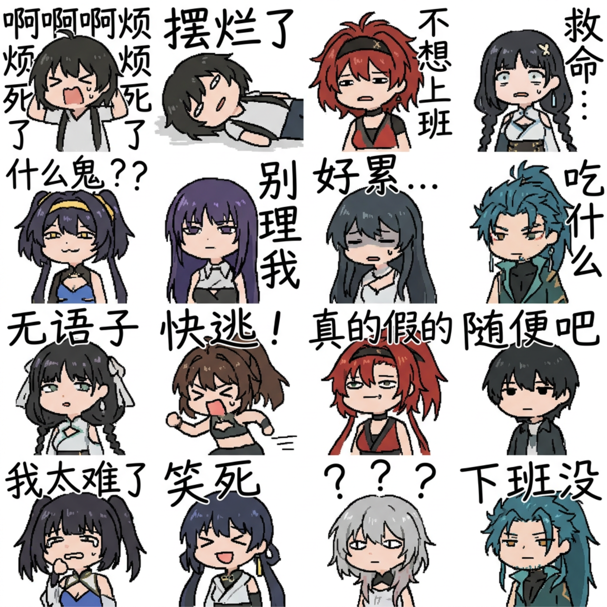
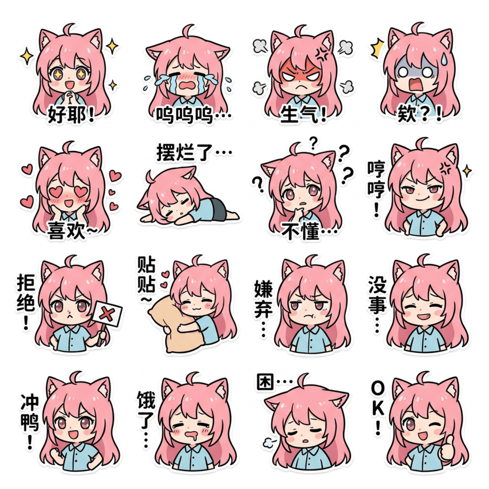

<div align="center">

# Image2 & Seedance 2 프롬프트 쿡북

*Image2 이미지 생성 및 Seedance 2 영상 생성을 위한 프롬프트 템플릿 라이브러리*

[English](README.md) | [简体中文](README.zh-CN.md) | [繁體中文](README.zh-TW.md) | [日本語](README.ja.md) | [한국어](README.ko.md) | [Bahasa Indonesia](README.id.md)


[](LICENSE)

</div>

---

## 개요

**Image2 & Seedance 2 프롬프트 쿡북**은 AI 기반 이미지 및 영상 생성을 위한 엄선된 프롬프트 템플릿 모음입니다. 시각적 스타일이 아닌 재사용 가능하고 구조화된 프롬프트 패턴에 중점을 둡니다.

본 프로젝트가 제공하는 것:
- 프롬프트 템플릿 저장을 위한 표준화된 `prompt.json` 형식
- 중국어 및 영어 다국어 프롬프트 지원
- 손쉬운 프롬프트 사용자 정의를 위한 구조화된 변수 시스템
- 각 프롬프트의 실제 사용 예시를 보여주는 예제 케이스
- 새로운 프롬프트 제출을 위한 자동 가져오기 파이프라인
- 모든 README 파일의 자동 생성 프롬프트 갤러리

## 지원 모델

| 모델 | 유형 | 설명 |
| --- | --- | --- |
| **Image2** | 이미지 생성 | 고품질 정지 이미지 생성 |
| **Seedance 2** | 영상 생성 | AI 구동 영상 클립 생성 |

## 디렉토리 구조

```
.
├── README.md                     # 영어
├── README.zh-CN.md               # 중국어 간체
├── README.zh-TW.md               # 중국어 번체
├── README.ja.md                  # 일본어
├── README.ko.md                  # 현재 파일 (한국어)
├── README.id.md                  # 인도네시아어
├── LICENSE                       # MIT 라이선스
├── package.json                  # 프로젝트 스크립트
├── scripts/
│   ├── import-prompt.mjs         # inbox/에서 프롬프트 가져오기
│   └── update-readme.mjs         # README 갤러리 재생성
├── .claude/
│   └── skills/
│       └── prompt-importer/
│           └── SKILL.md          # Claude Code 스킬 정의
├── assets/                       # 공유 에셋 (로고 등)
├── inbox/                        # 새 프롬프트 제출용
│   ├── image2/
│   └── seedance2/
├── templates/                    # 템플릿 파일
│   ├── image2.prompt.template.json
│   ├── seedance2.prompt.template.json
│   └── prompt.md.template
├── image2/                       # Image2 프롬프트 템플릿
│   ├── _template/                # 스키마 참조
│   ├── portrait/                 # 인물
│   ├── product/                  # 제품
│   ├── poster/                   # 포스터
│   ├── character/                # 캐릭터
│   ├── architecture/             # 건축
│   └── style/                    # 스타일
├── seedance2/                    # Seedance 2 프롬프트 템플릿
│   ├── _template/                # 스키마 참조
│   ├── cinematic/                # 시네마틱
│   ├── product-video/            # 제품 영상
│   ├── camera-movement/          # 카메라 워크
│   ├── character-motion/         # 캐릭터 애니메이션
│   ├── image-to-video/           # 이미지 투 비디오
│   └── social-video/             # 소셜 영상
└── docs/                         # 문서
    ├── prompt-json-spec.md       # JSON 형식 사양
    ├── image2-guide.md           # Image2 프롬프트 가이드
    ├── seedance2-guide.md        # Seedance 2 프롬프트 가이드
    └── contribution-guide.md     # 기여 가이드
```

## 프롬프트 JSON 형식

각 프롬프트는 표준화된 스키마를 가진 `prompt.json` 파일로 저장됩니다. 각 파일에는 다음이 포함됩니다:

- **메타데이터**: 이름, 슬러그, 모델, 버전, 카테고리
- **다국어 콘텐츠**: 중국어 및 영어 요약, 프롬프트, 네거티브 프롬프트
- **구조화된 변수**: 레이블과 예제가 포함된 교체 가능한 템플릿 변수
- **예제 케이스**: 템플릿의 실제 사용을 보여주는 완성된 프롬프트
- **권장 매개변수**: 화면 비율, 품질 설정 및 참고 사항

전체 사양은 [docs/prompt-json-spec.md](docs/prompt-json-spec.md)을 참조하세요.

## 프롬프트 추가 방법

1. `templates/prompt.md.template`을 `inbox/<model>/<your-slug>/prompt.md`에 복사
2. 프론트매터와 모든 섹션 작성
3. 같은 디렉토리에 미리보기 이미지(`example.jpg`) 배치
4. `npm run build` 실행

```bash
# 일반 가져오기 (기존 디렉토리 건너뛰기)
npm run build

# 기존 프롬프트 강제 덮어쓰기
npm run import -- --force
npm run update-readme
```

자세한 내용은 [docs/contribution-guide.md](docs/contribution-guide.md)를 참조하세요.

## 프롬프트 갤러리

<!-- PROMPT_GALLERY_START -->
| 미리보기 | 모델 | 분류 | 프롬프트 | 태그 |
| --- | --- | --- | --- | --- |
|  | image2 | portrait | [Soft Pink Boudoir Fashion Proposal](image2/portrait/soft-pink-boudoir-fashion-proposal/) | image2, portrait, fashion, infographic, chinese |
|  | image2 | sticker | [Chaotic MS Paint Chat Sticker Pack](image2/sticker/chaotic-mspaint-chat-sticker-pack/) | image2, sticker, meme, expression-pack, ms-paint |
|  | image2 | sticker | [Chibi Anime Chat Sticker Grid](image2/sticker/chibi-anime-chat-sticker-grid/) | image2, sticker, meme, chibi, anime |
<!-- PROMPT_GALLERY_END -->

## 기여

기여를 환영합니다! 전체 기여 워크플로우는 [docs/contribution-guide.md](docs/contribution-guide.md)를 확인하세요.

## 라이선스

본 프로젝트는 [MIT License](LICENSE)에 따라 라이선스가 부여됩니다.

## 면책 조항

본 프로젝트는 독립적인 커뮤니티 활동입니다. 어떤 AI 모델 제공업체와도 제휴 또는 승인 관계가 없습니다. 모든 프롬프트 템플릿은 커뮤니티에서 기여한 독창적인 작품입니다. 본 프로젝트는 생성된 이미지나 독점 모델 가중치를 배포하지 않습니다.
