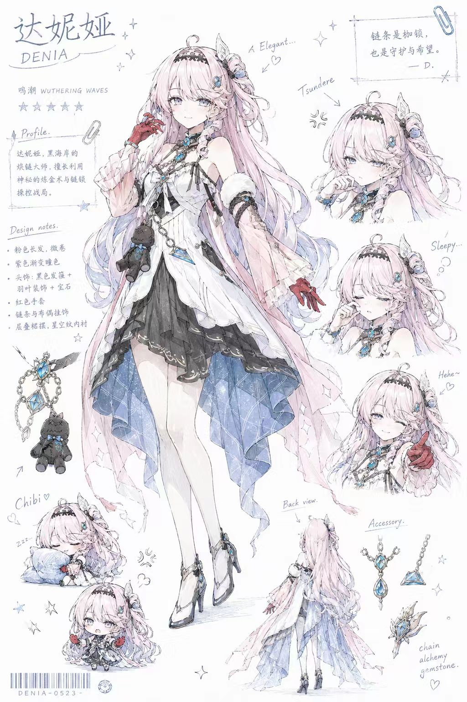
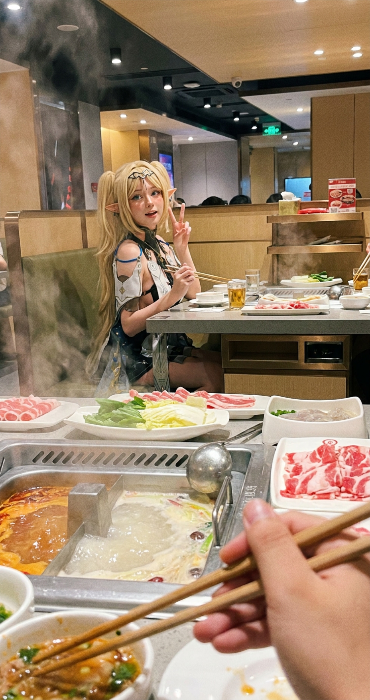
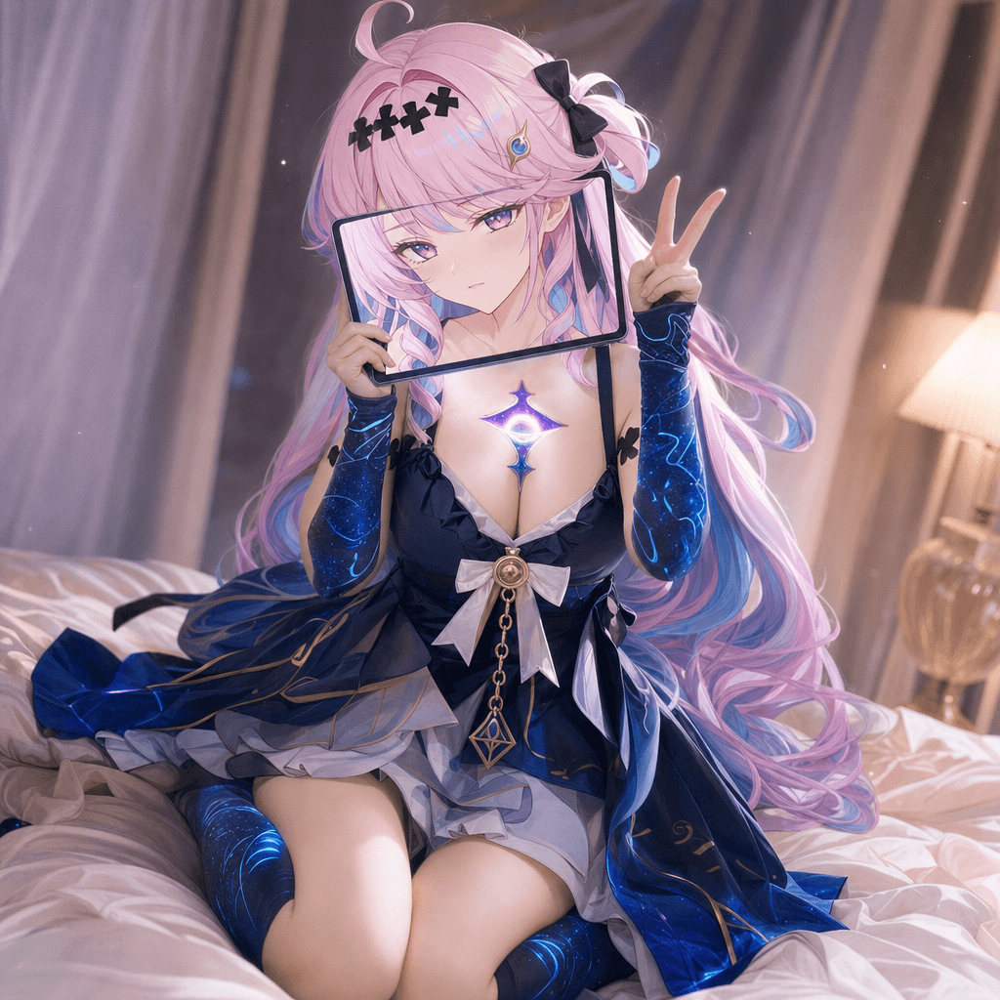
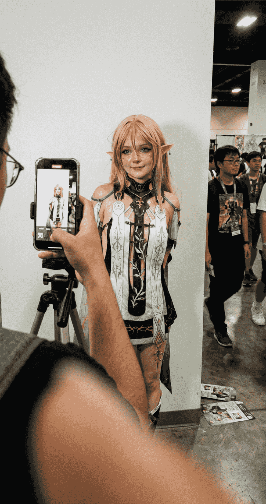
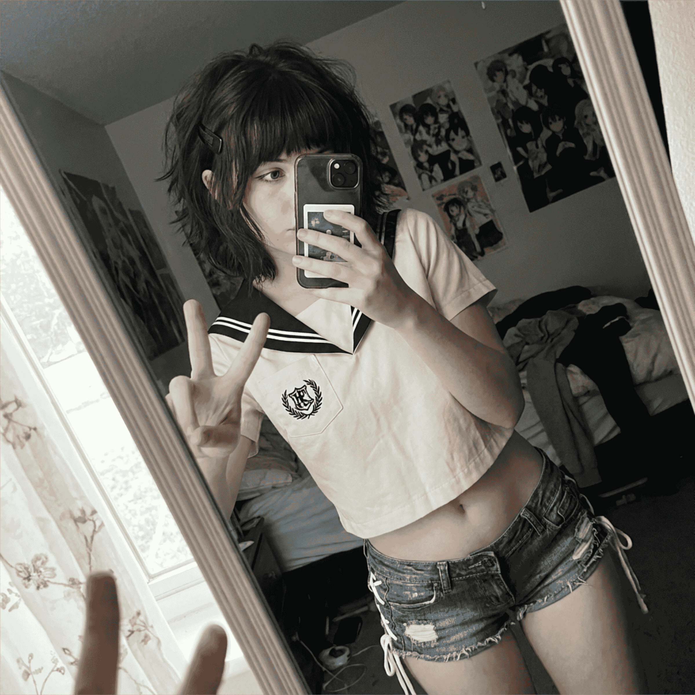
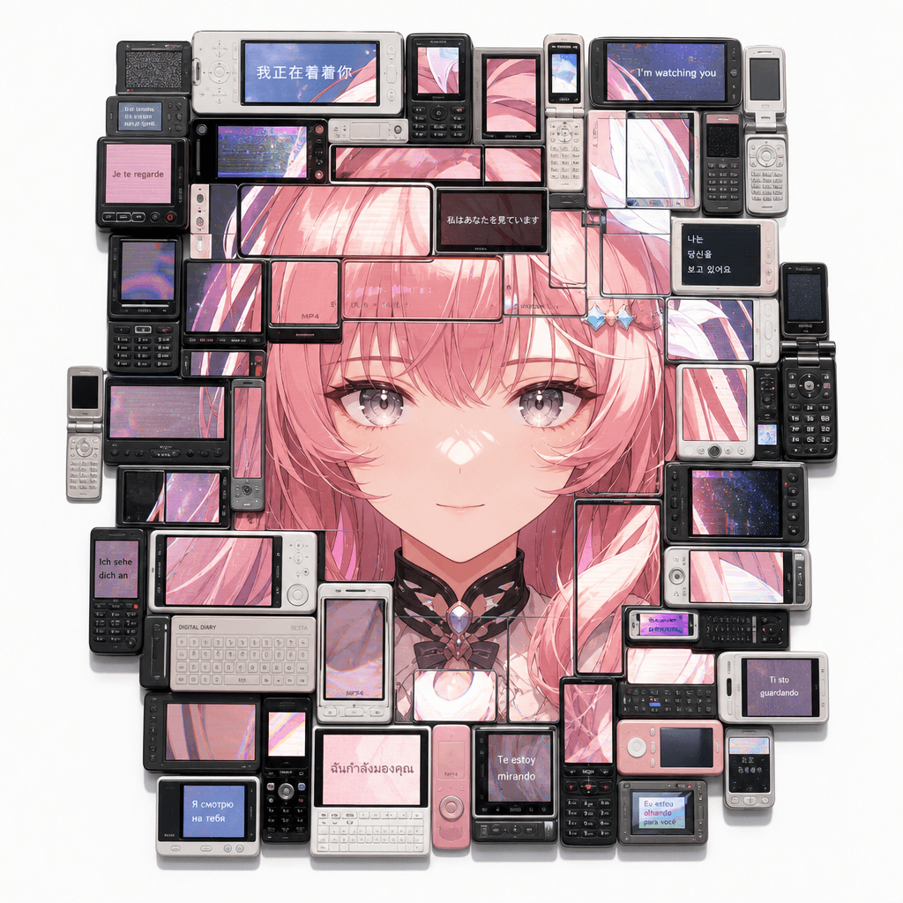
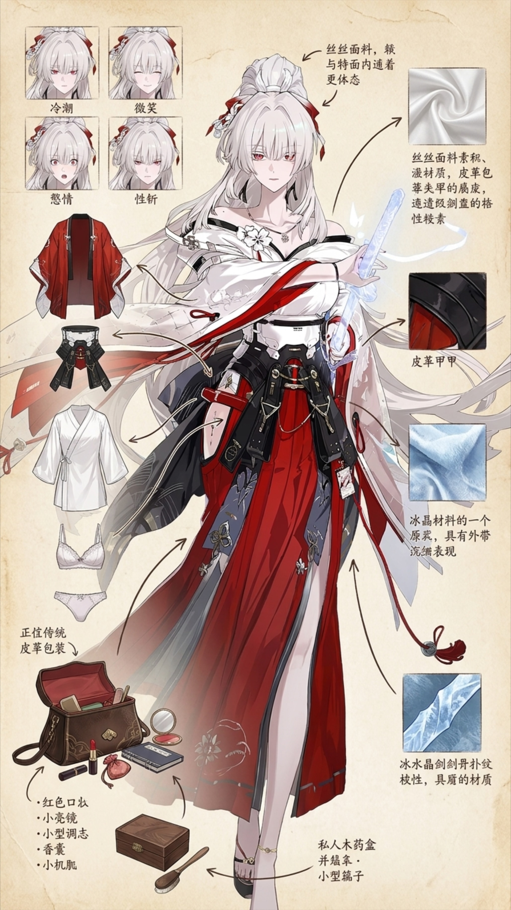
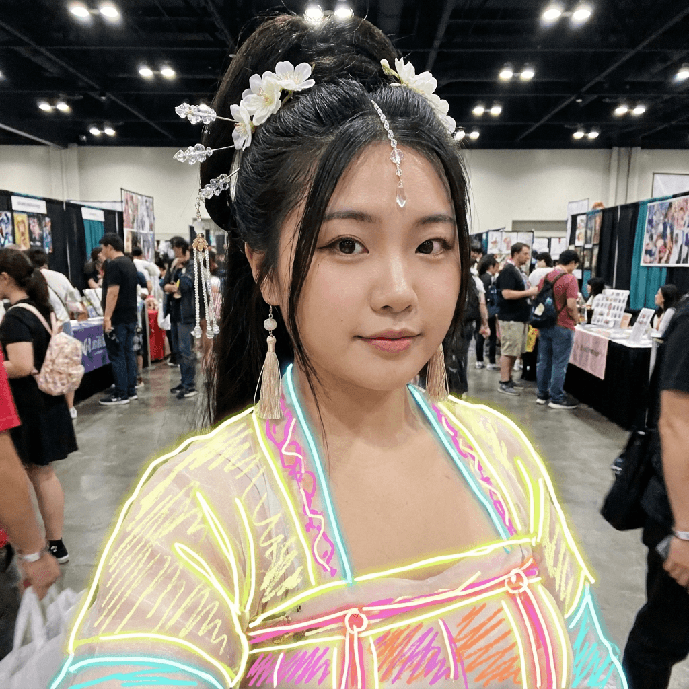

<div align="center">

# Image2 & Seedance 2 提示詞手冊

*專注於 Image2 圖像生成與 Seedance 2 影片生成的提示詞模板庫。*

[English](README.md) | [简体中文](README.zh-CN.md) | [繁體中文](README.zh-TW.md) | [日本語](README.ja.md) | [한국어](README.ko.md) | [Bahasa Indonesia](README.id.md)


[](LICENSE)

</div>

---

## 專案概述

**Image2 & Seedance 2 提示詞手冊** 是一個為 AI 圖像與影片生成精心整理的提示詞模板庫。專案專注於提供可複用、結構良好的提示詞模式，而非視覺風格參考。

本專案提供：
- 標準化的 `prompt.json` 格式用於儲存提示詞模板
- 中英雙語提示詞支援
- 結構化的變數系統，方便提示詞自訂
- 每個提示詞的範例案例展示
- 新提示詞自動匯入管線
- 所有 README 檔案自動生成提示詞目錄

## 支援的模型

| 模型 | 類型 | 說明 |
| --- | --- | --- |
| **Image2** | 圖像生成 | 高品質靜態圖像生成 |
| **Seedance 2** | 影片生成 | AI 驅動的影片片段生成 |

## 目錄結構

```
.
├── README.md                     # 英文說明
├── README.zh-CN.md               # 簡體中文
├── README.zh-TW.md               # 當前檔案（繁體中文）
├── README.ja.md                  # 日文
├── README.ko.md                  # 韓文
├── README.id.md                  # 印尼文
├── LICENSE                       # MIT 授權
├── package.json                  # 專案腳本
├── scripts/
│   ├── import-prompt.mjs         # 從 inbox/ 匯入提示詞
│   └── update-readme.mjs         # 重新生成 README 目錄
├── .claude/
│   └── skills/
│       └── prompt-importer/
│           └── SKILL.md          # Claude Code skill 定義
├── assets/                       # 共享資源（logo 等）
├── inbox/                        # 新提示詞提交存放處
│   ├── image2/
│   └── seedance2/
├── templates/                    # 模板檔案
│   ├── image2.prompt.template.json
│   ├── seedance2.prompt.template.json
│   └── prompt.md.template
├── image2/                       # Image2 提示詞模板
│   ├── _template/                # 模板參考
│   ├── portrait/                 # 人像
│   ├── product/                  # 產品
│   ├── poster/                   # 海報
│   ├── character/                # 角色
│   ├── architecture/             # 建築
│   └── style/                    # 風格
├── seedance2/                    # Seedance 2 提示詞模板
│   ├── _template/                # 模板參考
│   ├── cinematic/                # 電影感
│   ├── product-video/            # 產品影片
│   ├── camera-movement/          # 鏡頭運動
│   ├── character-motion/         # 角色動畫
│   ├── image-to-video/           # 圖生影片
│   └── social-video/             # 社群短影片
└── docs/                         # 文件
    ├── prompt-json-spec.md       # JSON 格式規範
    ├── image2-guide.md           # Image2 提示詞指南
    ├── seedance2-guide.md        # Seedance 2 提示詞指南
    └── contribution-guide.md     # 貢獻指南
```

## 提示詞 JSON 格式

每個提示詞以 `prompt.json` 檔案儲存，採用標準化模式。每個檔案包含：

- **中繼資料**：名稱、識別、模型、版本、分類
- **多語言內容**：中英文簡介、提示詞、反向提示詞
- **結構化變數**：可替換的模板變數，附帶標籤和範例
- **範例案例**：展示模板實際使用效果的完整提示詞
- **推薦參數**：長寬比、品質設定及備註

完整規範請參見 [docs/prompt-json-spec.md](docs/prompt-json-spec.md)。

## 如何新增提示詞

1. 複製 `templates/prompt.md.template` 到 `inbox/<model>/<your-slug>/prompt.md`
2. 填寫 frontmatter 和所有章節
3. 在同目錄下放置預覽圖片（`example.jpg`）
4. 執行 `npm run build`

```bash
# 普通匯入（跳過已有目錄）
npm run build

# 強制覆蓋已有提示詞
npm run import -- --force
npm run update-readme
```

詳細說明請參見 [docs/contribution-guide.md](docs/contribution-guide.md)。

## 提示詞目錄

<!-- PROMPT_GALLERY_START -->
| 預覽 | 模型 | 分類 | 提示詞 | 標籤 |
| --- | --- | --- | --- | --- |
|  | image2 | portrait | [Anime Pencil Sketch Character Design Sheet](image2/portrait/anime-pencil-sketch-character-design-sheet/) | image2, portrait, character-design, anime, pencil-sketch |
|  | image2 | portrait | [Casual iPhone Hotpot Cosplayer Snapshot](image2/portrait/casual-iphone-hotpot-cosplayer-snapshot/) | image2, portrait, cosplay, candid, iphone |
|  | image2 | portrait | [Dimension-Breaking Cosplay Tablet Face](image2/portrait/dimension-breaking-cosplay-tablet-face/) | image2, portrait, cosplay, creative-photography, dimension-breaking |
|  | image2 | portrait | [iPhone Anime Convention Cosplay Snapshot](image2/portrait/iphone-anime-convention-cosplay-snapshot/) | image2, portrait, cosplay, anime-convention, iphone-snapshot |
|  | image2 | portrait | [iPhone Mirror Selfie Cosplay Bedroom Portrait](image2/portrait/iphone-mirror-selfie-cosplay-bedroom/) | image2, portrait, cosplay, mirror-selfie, iphone-snapshot |
|  | image2 | portrait | [Multi-Device Screen Mosaic Character Close-up](image2/portrait/multi-device-screen-mosaic-character-closeup/) | image2, portrait, character-reference, screen-mosaic, electronic-devices |
|  | image2 | portrait | [Panoramic Character Concept Breakdown Sheet](image2/portrait/panoramic-character-concept-breakdown/) | image2, portrait, character-design, concept-art, anime |
|  | image2 | portrait | [Realistic Neon Doodle Cosplay Expo Selfie](image2/portrait/realistic-neon-doodle-cosplay-expo-selfie/) | image2, portrait, realistic, smartphone-photography, expo |
|  | image2 | portrait | [Soft Pink Boudoir Fashion Proposal](image2/portrait/soft-pink-boudoir-fashion-proposal/) | image2, portrait, fashion, infographic, chinese |
|  | image2 | sticker | [Chaotic MS Paint Chat Sticker Pack](image2/sticker/chaotic-mspaint-chat-sticker-pack/) | image2, sticker, meme, expression-pack, ms-paint |
|  | image2 | sticker | [Chibi Anime Chat Sticker Grid](image2/sticker/chibi-anime-chat-sticker-grid/) | image2, sticker, meme, chibi, anime |
<!-- PROMPT_GALLERY_END -->

## 貢獻

歡迎貢獻！完整貢獻流程請參見 [docs/contribution-guide.md](docs/contribution-guide.md)。

## 授權

本專案基於 [MIT License](LICENSE) 授權。

## 免責聲明

本專案為獨立社群專案。與任何 AI 模型提供商無關聯或認可關係。所有提示詞模板均為社群貢獻的原創作品。本專案不分發生成的圖像或專有模型權重。
